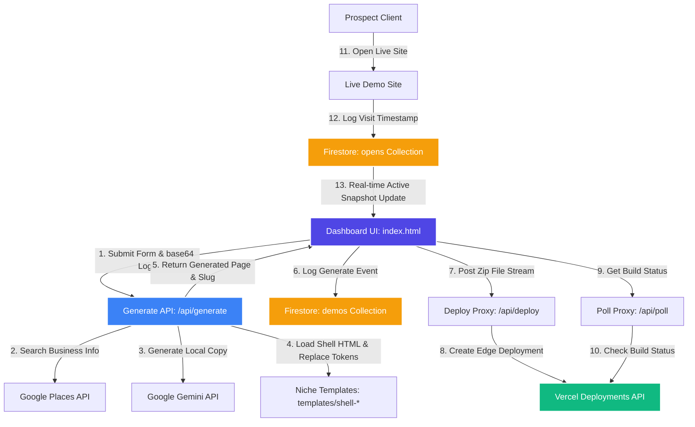

# Auto-Webibi End-to-End System Data Flow

This document details the architecture, data lifecycle, serverless routing, database schemas, and external APIs powering the **Auto-Webibi** AI generation and deployment platform.

---

## 1. System Architecture Overview

Auto-Webibi utilizes a hybrid serverless and client-side architecture designed for rapid, on-demand generation of mobile-first demo sites. It leverages Google Gemini AI for personalized copywriting, Google Places API for social proof enrichment, Google Cloud Firestore for analytics, and Vercel for real-time edge deployments.

---

## 2. Step-by-Step Data Flow

### Step 1: Form Submission & Asset Processing
1. The Sales Agent enters the target business details in the main control panel: [index.html](file:///Users/nagarjundp/auto-web/index.html).
2. If a local logo is selected, the browser reads the file as a FileReader object and encodes it as a base64 `data:image/...` Data URL.
3. The dashboard issues an HTTP `POST` request to the Next.js API backend: [route.ts](file:///Users/nagarjundp/auto-web/webibi-demo/src/app/api/generate/route.ts).

### Step 2: Google Places Enrichment
1. The Next.js API handler retrieves the Google Places API Key.
2. If configured, it hits the Google Places Text Search endpoint using the business name and city to retrieve its `place_id`, `rating`, and total `user_ratings_total` (Review Count).
3. Using the `place_id`, it requests details from the Places Details endpoint to pull the text content of the highest-rated customer review.
4. **Fallback Mode**: If no API key exists, it dynamically injects mock ratings (e.g. `4.8`) and reviews tailored to the city and niche.

### Step 3: Copywriting Engine (Google Gemini AI)
1. The generator sends a structured prompt to the Gemini API (`gemini-2.5-flash`) containing the enriched ratings and review details.
2. The model generates 5 contextually relevant local copywriting strings (Tagline, Hero Headline, Hero Subline, About Text, CTA Text) and returns them in a strict JSON format.
3. **Fallback Mode**: If the Gemini API fails or is unconfigured, default localized copy strings are generated programmatically.

### Step 4: Template Synthesis & Logo Cleaning
1. The API reads the corresponding industry HTML file from the [templates](file:///Users/nagarjundp/auto-web/webibi-demo/templates) folder:
   - `shell-restaurant.html`
   - `shell-salon.html`
   - `shell-gym.html`
   - `shell-clinic.html`
   - `shell-events.html`
2. **Attribute Sanitization**: Before replacing placeholders, the API sweeps the `logoDataUrl` and replaces all double quotes (`"`) with single quotes (`'`). This prevents raw inline SVG XML parameters from breaking HTML image tags like `src="{{LOGO_URL}}"`.
3. Placeholders (e.g., `{{BUSINESS_NAME}}`, `{{COLOR_PRIMARY}}`, `{{LOGO_URL}}`, `{{TOP_REVIEW}}`) are replaced using global string substitutions.
4. The synthesized page is written locally to `public/demos/{slug}.html` and returned to the client as an HTML response.

### Step 5: Database Logging (Firestore)
Upon receiving the successful HTML response from the Next.js API, the client dashboard saves a copy of the payload to Cloud Firestore:
- **Collection**: `demos`
- **Fields**: Real-time timestamps, business parameters, and configuration payload.

### Step 6: Deploy & Stream to Edge Hosting (Vercel Proxy)
1. The dashboard client compiles the generated files (HTML, CSS variables, assets) into a zip payload in-memory.
2. It sends the payload stream to the backend proxy [deploy.js](file:///Users/nagarjundp/auto-web/api/deploy.js).
3. The serverless function streams the zip directly to the Vercel Deployments API (`https://api.vercel.com/v13/deployments`) authenticated with the secure `VERCEL_TOKEN`.
4. The dashboard client receives a deployment ID and starts polling [poll.js](file:///Users/nagarjundp/auto-web/api/poll.js) at regular intervals to track build status.
5. Once the deployment transition status moves to `READY`, the client is provided with a live URL (e.g., `https://auto-web-seven.vercel.app/demos/{slug}.html`).

### Step 7: View Analytics & Prospect Monitoring
1. When a prospect opens the live demo page, a tracking pixel script initializes.
2. The page connects to the Firestore instance and adds a record containing a client ID, location info, and timestamp to the `opens` collection.
3. The Sales Agency Dashboard [index.html](file:///Users/nagarjundp/auto-web/index.html) maintains a live Firestore snapshot listener on the `opens` collection. The moment the prospect views the page, a live view alert is pushed to the dashboard screen, notifying the sales representative in real-time.

---

## 3. Database Schema Definitions (Google Firestore)

### Collection: `demos`
Stores records of generated business demo sites.

| Field Name | Type | Description |
| :--- | :--- | :--- |
| `name` | `string` | The user-provided name of the local business. |
| `industry` | `string` | Niche category (`restaurant`, `salon`, `gym`, `clinic`, `events`). |
| `city` | `string` | The target city of the local business. |
| `phone` | `string` | Contact phone number for the CTA touch targets. |
| `primaryColor` | `string` | The hex code chosen for the primary theme colors. |
| `logoDataUrl` | `string` | Base64 data URI of the custom logo. |
| `generatedAt` | `timestamp` | Server timestamp when the generation API was completed. |
| `slug` | `string` | The clean URL path identifier (e.g., `luigis-bistro`). |
| `sentViaWhatsApp`| `boolean` | Set to true when the sales agent shares it with the client. |
| `sentAt` | `timestamp` | Timestamp showing when it was shared. |

### Collection: `opens`
Tracks real-time interaction logs when prospects view the live URLs.

| Field Name | Type | Description |
| :--- | :--- | :--- |
| `demoSlug` | `string` | The slug of the demo site being viewed. |
| `businessName`| `string` | The name of the business associated with the slug. |
| `lastActive` | `timestamp` | The timestamp of the client's most recent interaction. |
| `device` | `string` | User agent parse mapping (Mobile / Tablet / Desktop). |
| `userAgent` | `string` | The raw browser user agent string. |
| `viewsCount` | `number` | Count of total pages accessed during this prospect session. |

---

## 4. Associated Backend API Routing Configurations

- **[firebase-config.js](file:///Users/nagarjundp/auto-web/api/firebase-config.js)**: Distributes secure Firestore initialize vectors client-side without exposing production auth console privileges.
- **[deploy.js](file:///Users/nagarjundp/auto-web/api/deploy.js)**: Configured to support raw stream buffering (`bodyParser: false`) to safely route full zip payloads to the Vercel Deploy API without Node memory leaks.
- **[poll.js](file:///Users/nagarjundp/auto-web/api/poll.js)**: Queries state flags (`BUILDING`, `READY`, `ERROR`) from Vercel to coordinate client progress bars.