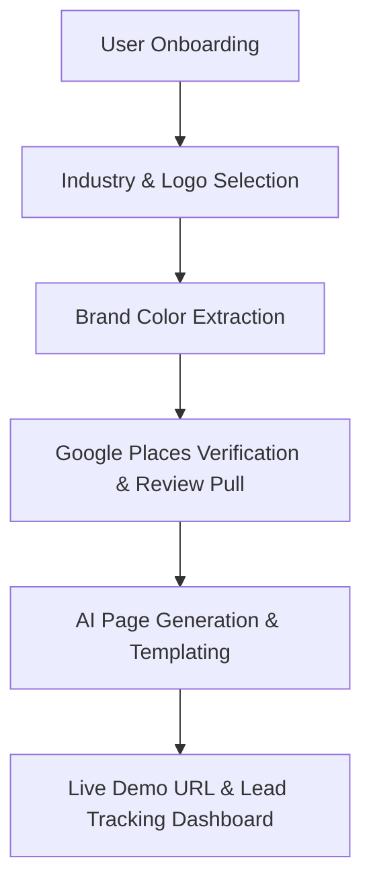

# Product Requirement Document (PRD): Webibi Demo Generator
*Empowering agency sales with instantly generated, hyper-personalized local business demo websites.*

---

## 1. Product Vision & Goals

### 1.1 Problem Statement
When agencies pitch website development services to local small businesses (restaurants, salons, gyms, etc.), they face a "blank canvas" trust gap. Generic slide decks or templates fail to capture the client's imagination, while building custom mockups manually for every sales prospect is too time-consuming and expensive.

### 1.2 The Solution: Webibi Demo
**Webibi Demo** is a 60-second sales enablement tool that generates a live, fully branded, and hyper-personalized website mockup for a local business. By simply uploading a logo and entering basic information, the tool builds a complete, high-converting landing page matching the business's exact color palette, location, and real customer reviews.



### 1.3 Key Objectives
- **Zero Friction**: Generate a personalized site in under 60 seconds with minimal input.
- **The "Wow" Factor**: Instantly extract brand colors from the user's logo and inject their actual Google Maps ratings and positive reviews.
- **Agency Utility**: Provide simulated real-time tracking metrics (views, duration) to demonstrate client interest and prove the value of a professional site.

---

## 2. Target Audience & Personas

- **Local Business Owners**: Want a fast, simple way to see what their business would look like online without technical jargon or upfront costs.
- **Agency Sales Teams**: Need an instant, high-quality sales asset they can generate during a live pitch or cold-outreach campaign.

---

## 3. Core Features & Functional Requirements

### 3.1 Verification & Onboarding (`LandingScreen`)
- **Dual-Method Verification**: 
  - One-tap phone verification using the secure `phone.email` authentication protocol.
  - Email verification via a simulated 4-digit OTP code flow.
- **Lead Generation**: Captures verified contact info before proceeding to prevent anonymous spam and gather high-intent leads.

### 3.2 Dynamic Color Extraction (`DetailsScreen`)
- **Logo Color DNA**: When a logo is uploaded, client-side image analysis (`ColorThief`) extracts the 5 most dominant colors in the palette.
- **Active Color Theme Selection**: Automatically assigns the primary color and displays the palette as clickable color chips to refine the brand's aesthetic.

### 3.3 Google Places Enrichment (`api/generate`)
- **Automatic Identity Match**: Performs a background Text Search to find the business using the format: `{Business Name} in {City}`.
- **Social Proof Injection**: Retrieves the overall rating, total rating count, and top reviews to inject directly into the website's testimonial section.
- **Believable Fallbacks**: If API limits are reached or a business isn't listed, a location-aware smart mockup is loaded.

### 3.4 Multi-Industry HTML Templating
The generator supports tailored layouts for major local business sectors:
| Industry ID | Name | Template File | Style / Aesthetic |
| :--- | :--- | :--- | :--- |
| `restaurant` | Restaurant | `templates/restaurant.html` | Playfair typography, gold/brand highlights, interactive menu placeholders |
| `salon` | Salon & Spa | `templates/salon.html` | Sleek dark backgrounds, modern layout, service listings |
| `gym` | Gym & Fitness | `templates/gym.html` | High contrast, bold fonts, schedule placeholders |
| `clinic` | Clinic | `templates/clinic.html` | Clean, professional, doctor/staff profiles, blue/green highlights |
| `events` | Events | `templates/events.html` | Festive, celebration imagery, booking CTA |
| `default` | Fallback | `templates/default.html` | Clean multi-purpose layout |

### 3.5 Simulated Analytics & Lead Nurturing (`ResultScreen`)
- **Preview Frame**: A responsive viewport displaying the live generated HTML demo.
- **Real-Time Analytics Simulator**: Ticks up counts over time to simulate actual visitors:
  - **5 seconds**: 1 View (Status: "Viewed")
  - **8 seconds**: Avg Time: 45s
  - **15 seconds**: 3 Views (Status: "Hot Lead")
- **Instant Actions**:
  - **Copy Link**: Copies the unique demo URL (e.g., `/demos/rustic-bean-coffee.html`).
  - **WhatsApp Share**: Pre-fills a sales-ready outreach message to send to the client or business team.

---

## 4. System Architecture & Technical Stack

### 4.1 Technology Stack
- **Frontend Framework**: Next.js 14 (App Router)
- **Styling**: TailwindCSS & Framer Motion (for premium transitions and loaders)
- **Image Processing**: `ColorThief` (for client-side color extraction)
- **Database / Storage**: Local file generation inside `public/demos/[slug].html` (optionally integrated with Vercel API for deployment)

### 4.2 Template Interpolation Tokens
The templating engine reads physical HTML files and does string replacement for the following placeholder tokens:
```txt
{{BUSINESS_NAME}}   - Name of the business
{{CITY}}            - Location of the business
{{TAGLINE}}         - Tagline or catchphrase
{{HERO_HEADLINE}}   - Main header text
{{HERO_SUBLINE}}    - Sub-header text
{{ABOUT_TEXT}}      - Custom about copy
{{LOGO_URL}}        - Logo image (base64/URL)
{{PHONE}}           - Phone number
{{COLOR_PRIMARY}}   - Main brand hex code
{{GOOGLE_RATING}}   - Verified Google Maps rating
{{REVIEW_COUNT}}    - Total Google reviews
{{TOP_REVIEW}}      - Actual review content
```

---

## 5. Future Roadmap & Enhancements

1. **AI Copywriting Optimization**: Integrate deep Claude/GPT API calls to write hyper-specific, SEO-optimized body copy based on custom prompts.
2. **True Analytics integration**: Hook up real Firestore collections (using the parent `api/` tracking mechanism) to log actual visitor sessions, timestamps, and scroll depths when the client visits the live demo.
3. **One-Click Domain Hosting**: Integrate the parent Vercel Deployment engine (`api/deploy.js`) to export and host the site as a standalone project under a custom subdomain in one click.
